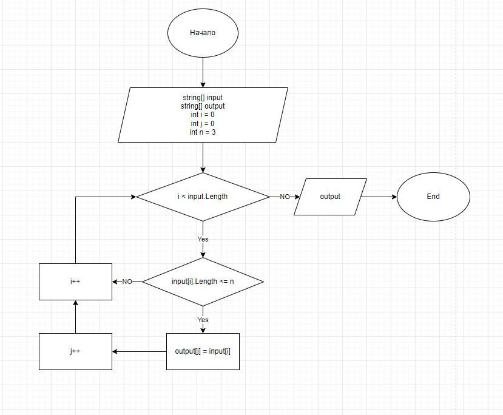

# Итоговая проверочная работа

Для полноценного выполнения проверочной работы необходимо:

1. Создать репозиторий на *GitHub*
2. Нарисовать алгоритм блок-схемы (можно использовать основную содержательную часть блок-схемы, если вы предлагаете ее в отдельном методе)
3. Создать репозиторий оформленных текстовых описаний решений (файл *README.md*)
4. Написать программу, решающую поставленную задачу
5. Использовать метод контроля в работе над этим небольшим проектом (не должно быть так, чтобы все залито одним коммитом, как минимум этапы 2, 3 и 4 должны быть расположены в разных коммитах)

## Задача:

Написать программу, которая из имеющегося массива строк формирует новый массив из строк, длина которых меньше, либо равна 3 символам. Первоначальный массив можно ввести с клавиатуры, либо задать на старте выполнения алгоритма. При решении не рекомендуется пользоваться коллекциями, лучше обойтись исключительно массивами.

Примеры:
[“Hello”, “2”, “world”, “:-)”] → [“2”, “:-)”]

[“1234”, “1567”, “-2”, “computer science”] → [“-2”]

[“Russia”, “Denmark”, “Kazan”] → []

### Блок-схема алгоритма:

## Алгоритм решения:

1. Делаем перебор значений из исходного массива;
2. Проверяем каждое значение из массива на соответствие условию: длина строки меньше или равна трем;
3. Если строка удовлетворяет условию, то кладем значение в новый массив;
4. Повторяем пункты 2 и 3 до тех пор, пока не дойдем до конца исходного массива;
5. Выводим новый заполненый массив как результат;

## Код:
Написанный код в файле *Program.cs*.